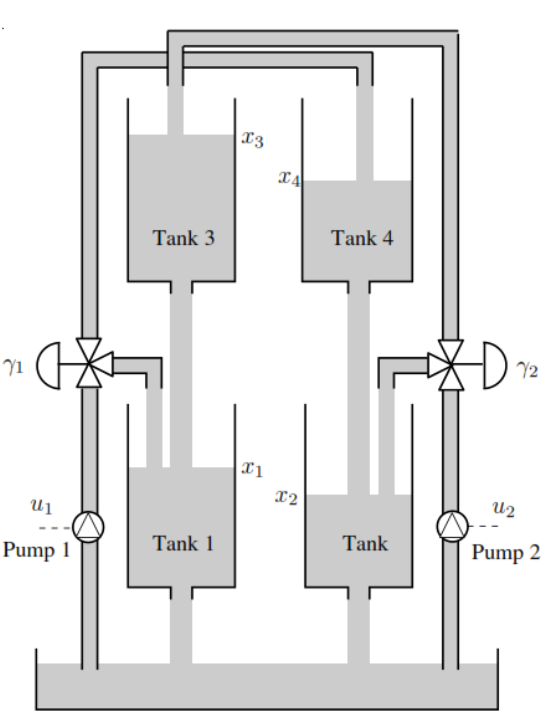
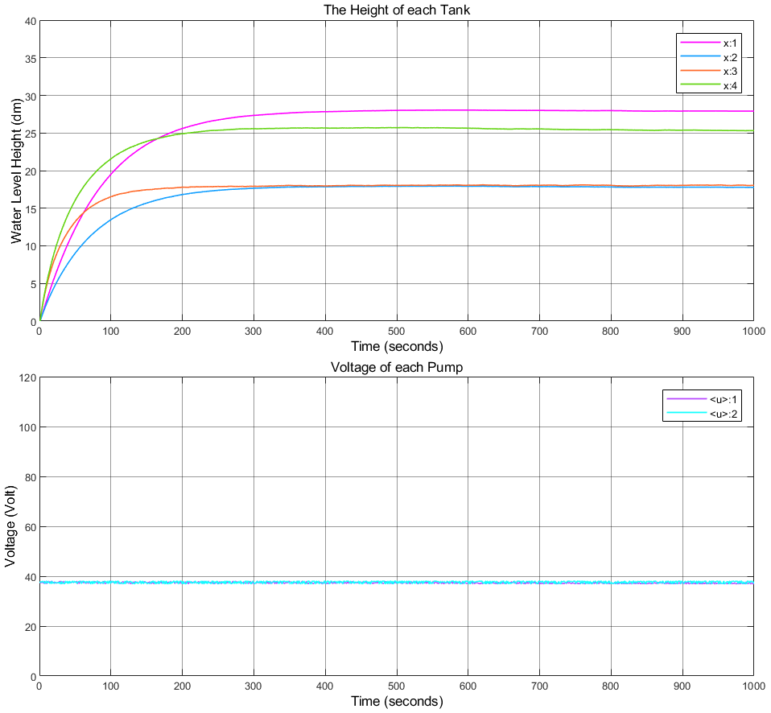

# RL-Based Control of Reservoir Systems Using SAC and PPO

## Author

**Muzhaffar Maruf Ibrahim**

Department of Automatic Control & Systems Engineering, University of Sheffield

---

## 🧠 Abstract

This project presents a **comparative study** of two state-of-the-art **Reinforcement Learning (RL)** algorithms — **Soft Actor-Critic (SAC)** and **Proximal Policy Optimization (PPO)** — applied to **single-tank and quadruple-tank water level control systems**. The research benchmarks these RL methods against the conventional **PID controller**, using **MATLAB's Reinforcement Learning Toolbox** introduced in **R2024a**.

The controllers:

* Achieve optimal tracking of water level setpoints
* Minimize overshoot and steady-state error
* Operate effectively in nonlinear and dynamic environments
* Are trained using Simulink-integrated environments

---

## 🧾 Problem Statement

This study focuses on nonlinear water tank systems, described by their dynamics:

* **Single-Tank System**
  Based on gravitational outflow and inflow rate control via voltage-regulated pumps.

* **Quadruple-Tank System**
  A MIMO system governed by coupled nonlinear equations with two pumps and multiple interacting tanks.

Control goals include:

* Achieving accurate water level tracking
* Minimizing rise time and overshoot
* Handling control saturation and nonlinear flow behavior

---

## 🎯 Control Objective

* Evaluate SAC and PPO for trajectory tracking
* Compare with classical PID control
* Use shared metrics: rise time, overshoot, steady-state error, and reward
* Deploy Simulink environments for reproducibility
* Tune hyperparameters for real-time convergence and optimal performance

---

## ✅ Algorithms Compared

| Algorithm | Type           | Policy        | Characteristics              |
| --------- | -------------- | ------------- | ---------------------------- |
| **PID**   | Classical      | Rule-based    | Fast but brittle             |
| **DDPG**  | RL, Off-Policy | Deterministic | Sensitive to noise           |
| **SAC**   | RL, Off-Policy | Stochastic    | High exploration & stability |
| **PPO**   | RL, On-Policy  | Stochastic    | Stable, high accuracy        |

---

## 🔍 Model Overview

### **Single-Tank System**

  

Governing equation:

$$
A \\frac{dH(t)}{dt} = bV - a\\sqrt{H}
$$

### **Quadruple-Tank System**

  

Governing equation:

## State Equations

  

## Notes

- \( g \): Acceleration due to gravity
- \( A_i \): Cross-sectional areas of the tanks
- \( a_i \): Outlet coefficients
- \( \gamma_1, \gamma_2 \): Flow distribution ratios

* Inputs: voltages $u_1, u_2$
* Outputs: water levels $h_1, h_2$
* Coupled nonlinear flow dynamics

---

## 📊 Performance Metrics

| Controller | System         | Overshoot (%) | Ts (s)   | Reward   |
| ---------- | -------------- | ------------- | -------- | -------- |
| PID        | Single-Tank    | High          | Fast     | —        |
| SAC        | Single-Tank    | Low           | Fast     | High     |
| PPO        | Single-Tank    | Very Low      | Slow     | Moderate |
| SAC        | Quadruple-Tank | Best Overall  | Fast     | High     |
| PPO        | Quadruple-Tank | Unstable      | Diverged | Low      |

---

## 📈 Training Visualization

* **SAC Performance on Single-Tank:**

  

## 🧰 Implementation

MATLAB/Simulink environments were created for each case:

* `single_tank_pid.mdl` — PID benchmark
* `single_tank_sac.mlx` — SAC agent training
* `single_tank_ppo.mlx` — PPO agent training
* `quadruple_tank_sac.mlx` — Advanced RL on MIMO system
* `quadruple_tank_ppo.mlx` — PPO comparison

---

## 📚 References

> Key works include:
>
> * Sutton & Barto (2018) – *Reinforcement Learning: An Introduction*
> * Haarnoja et al. (2018) – *Soft Actor-Critic Algorithms*
> * Schulman et al. (2017) – *Proximal Policy Optimization*
> * Rajesh Siraskar (2021) – *Reinforcement Learning for Valve Control*

For full list, see the final report PDF.

---

## 📩 Contact

*Muzhaffar Maruf Ibrahim*
[mmibrahim2@sheffield.ac.uk](mailto:mmibrahim2@sheffield.ac.uk)

---

Let me know if you'd like this exported as a `README.md` file or adapted for LaTeX.
